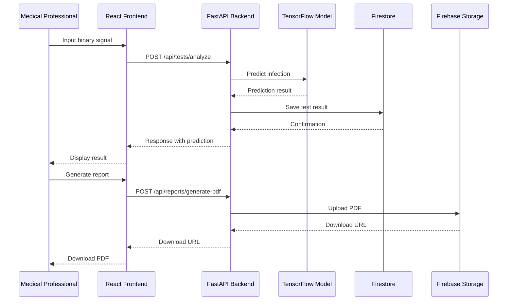
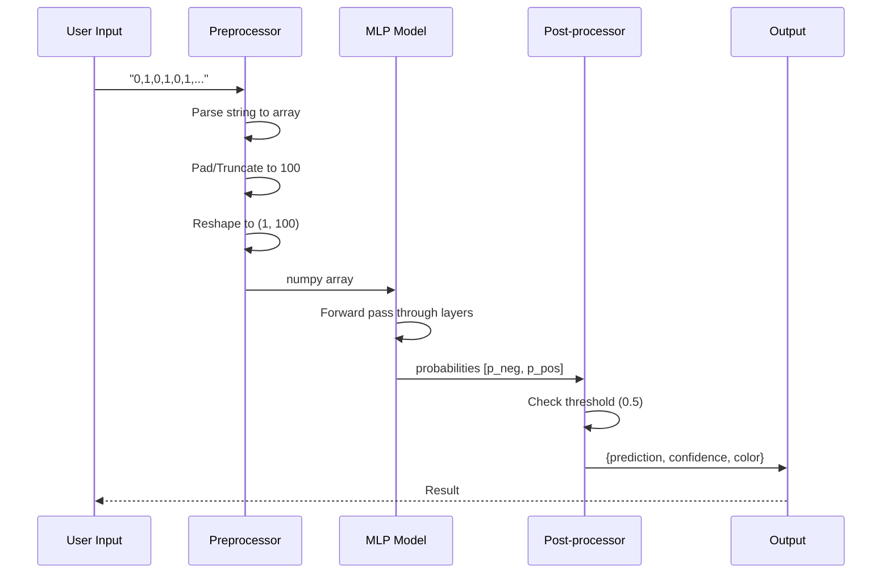
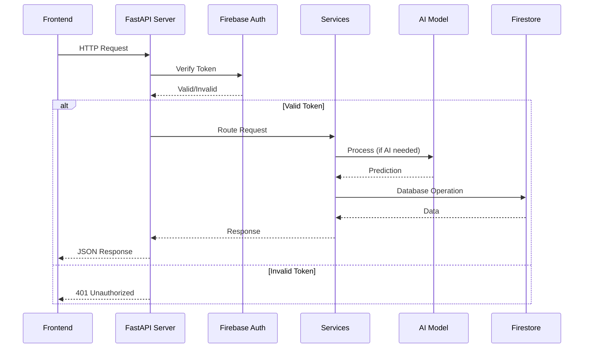
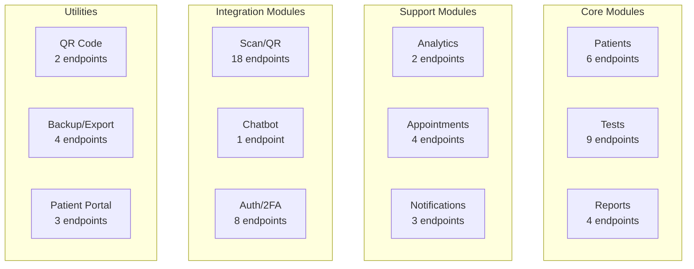
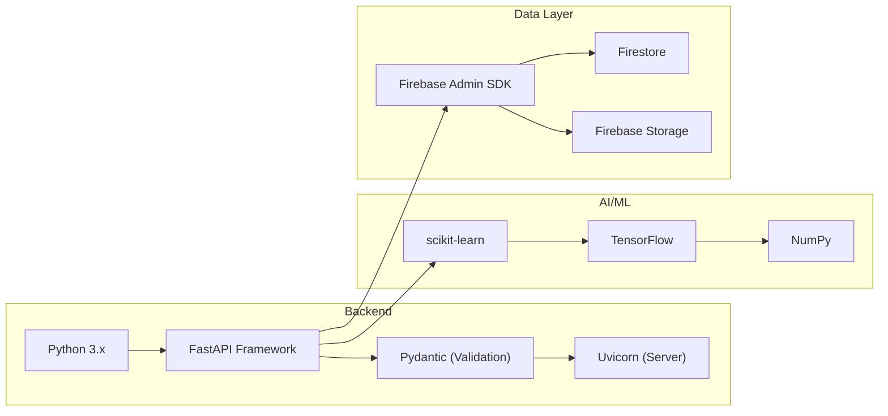
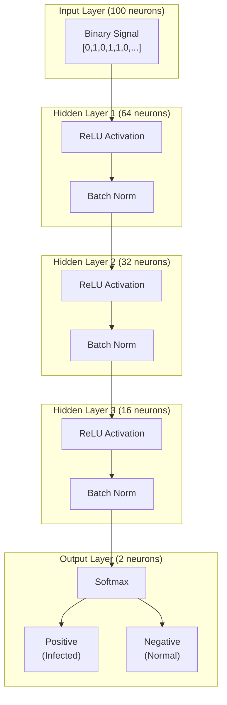
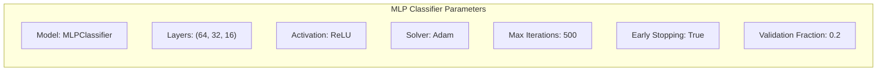
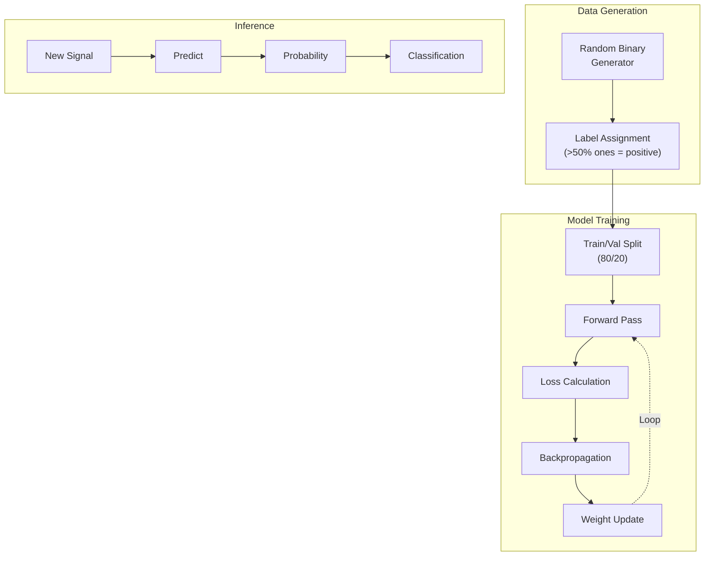
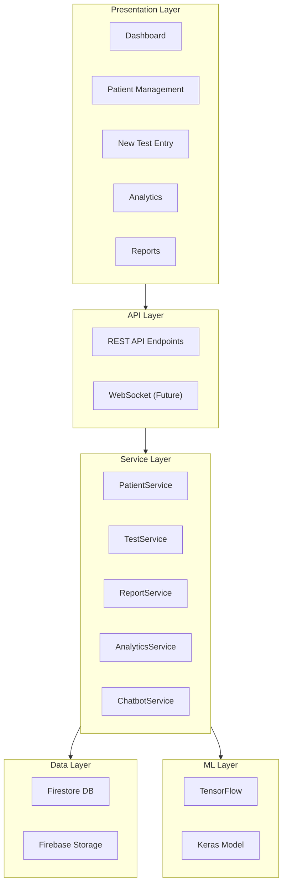

# System Architecture - H. pylori Nanopaper Detection System

```mermaid
flowchart TB
    subgraph Client["Frontend (React + Vite)"]
        UI["User Interface"]
        Router["React Router"]
        State["State Management"]
        API["API Client"]
    end

    subgraph Browser["Browser"]
        JS["JavaScript Engine"]
        CSS["Tailwind CSS"]
    end

    subgraph Cloud["Firebase Cloud"]
        Auth["Firebase Auth"]
        Firestore["Firestore Database"]
        Storage["Firebase Storage"]
    end

    subgraph Backend["Backend (FastAPI + Python)"]
        API_Server["FastAPI Server"]
        Routes["API Routes"]
        Models["Data Models"]
        
        subgraph AI["AI/ML Module"]
            TensorFlow["TensorFlow/Keras"]
            Model["H. pylori Detection Model"]
        end
        
        subgraph Services["Business Logic"]
            PatientSvc["Patient Service"]
            TestSvc["Test Service"]
            ReportSvc["Report Service"]
            AnalyticsSvc["Analytics Service"]
            ChatbotSvc["Chatbot Service"]
        end
    end

    subgraph Deployment["Deployment"]
        Hosting["Firebase Hosting"]
        Render["Render (Backend)"]
    end

    User["Medical Professional"] --> UI
    UI --> Router
    Router --> State
    State --> API
    
    API -->|HTTP/REST| API_Server
    
    API_Server --> Routes
    Routes --> Models
    
    Routes --> PatientSvc
    Routes --> TestSvc
    Routes --> ReportSvc
    Routes --> AnalyticsSvc
    Routes --> ChatbotSvc
    
    TestSvc -->|Predict| TensorFlow
    TensorFlow --> Model
    
    PatientSvc --> Firestore
    TestSvc --> Firestore
    ReportSvc --> Firestore
    AnalyticsSvc --> Firestore
    
    ReportSvc -->|Store Reports| Storage
    
    API_Server -->|OAuth| Auth
    Auth --> Firestore
    
    Hosting -->|"Static Assets"| Browser
    Render -->|"Backend API"| Cloud
```

---

## Backend API Architecture

### FastAPI Server Structure

### API Endpoints Overview

### Request/Response Flow

### Endpoint Categories

### Technology Stack

| Module | Endpoints | Description |
|--------|-----------|-------------|
| Auth | 8 | User registration, login, 2FA |
| Patients | 9 | CRUD operations, treatment tracking |
| Tests | 9 | Analysis, batch processing, confirmations |
| Reports | 4 | PDF/CSV generation |
| Analytics | 2 | Summary statistics, trends |
| Appointments | 4 | Scheduling CRUD |
| Scan/QR | 18 | QR code scanning, patient lookup |
| Notifications | 3 | Alert management |
| Chat | 1 | AI chatbot |
| Backup/Export | 4 | Data export, backup/restore |

### MLP Classifier for H. pylori Detection

### Model Configuration

### Data Flow - Signal Processing

### Training Pipeline

### Model Specifications

| Parameter | Value |
|-----------|-------|
| Model Type | MLPClassifier (sklearn) |
| Hidden Layers | (64, 32, 16) |
| Activation | ReLU |
| Optimizer | Adam |
| Max Iterations | 500 |
| Early Stopping | True |
| Validation Fraction | 0.2 |
| Input Size | 100 (binary signal length) |
| Output Classes | 2 (Positive/Negative) |
| Training Samples | 2000 (synthetic) |

---

## Data Flow

