# System Architecture - H. pylori Nanopaper Detection System

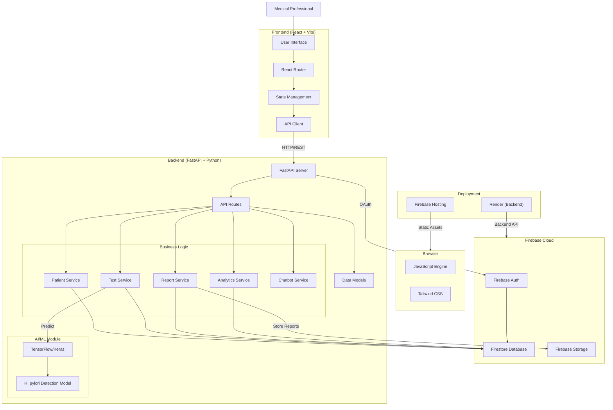

---

## Frontend Architecture

### React Application Structure

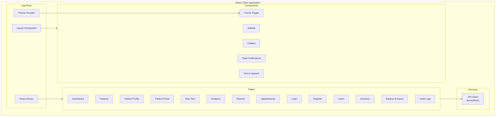

### Component Hierarchy

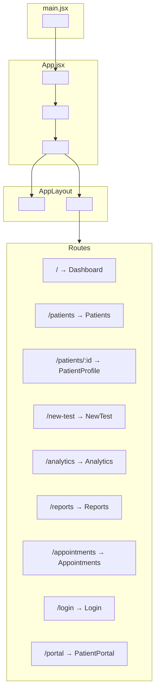

### Page Flow & Navigation

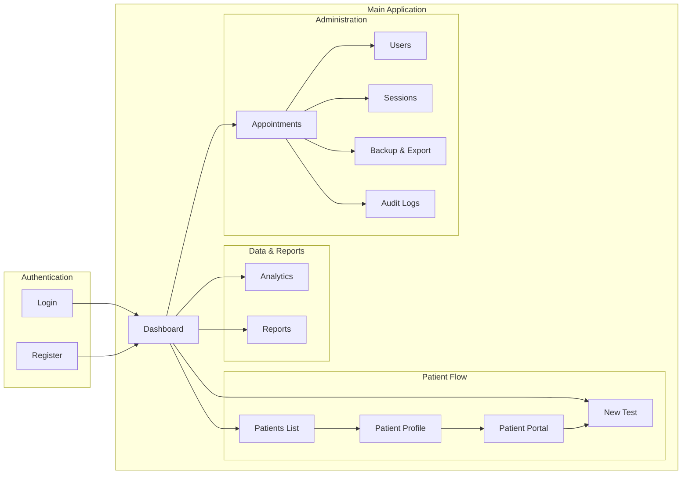

### State Management & Data Flow

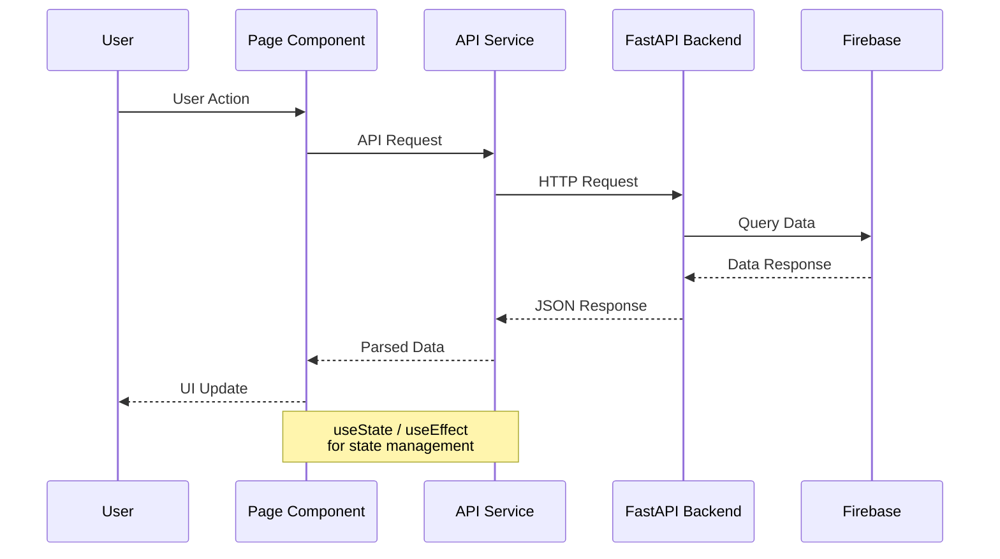

### Technology Stack

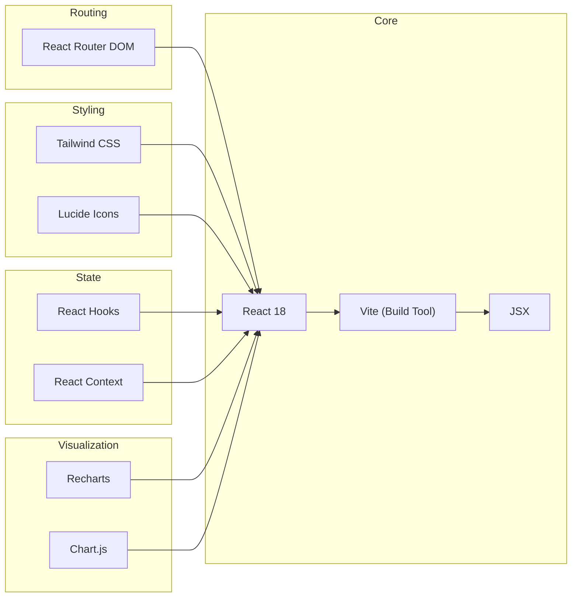

### Feature Modules

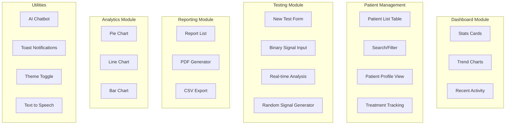

### API Integration

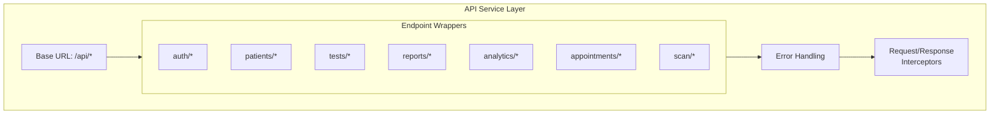

| Module | Components | Description |
|--------|------------|-------------|
| Auth | Login, Register | User authentication |
| Dashboard | Stats, Charts | Overview & quick actions |
| Patients | List, Profile, Portal | Patient management |
| Testing | NewTest, Analysis | Test execution |
| Analytics | Charts | Data visualization |
| Reports | PDF, CSV | Report generation |
| Appointments | CRUD | Scheduling |
| Utilities | Chatbot, Toast, Theme | UX enhancements |

### FastAPI Server Structure

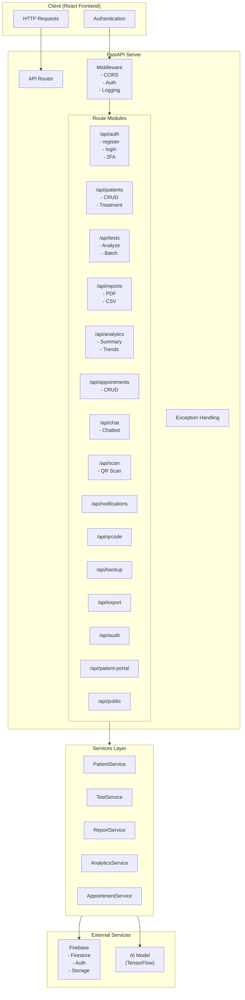

### API Endpoints Overview

```mermaid
flowchart LR
    subgraph Auth["Auth Module"]
        R1["POST /register"]
        R2["POST /login"]
        R3["GET /me"]
        R4["POST /2fa/*"]
    end

    subgraph Patients["Patient Module"]
        P1["GET /patients"]
        P2["POST /patients"]
        P3["GET /patients/{id}"]
        P4["PUT /patients/{id}"]
        P5["DELETE /patients/{id}"]
        P6["PUT /patients/{id}/treatment"]
    end

    subgraph Tests["Test Module"]
        T1["GET /tests"]
        T2["POST /tests"]
        T3["POST /tests/analyze"]
        T4["POST /tests/generate-random"]
        T5["POST /tests/batch"]
        T6["POST /tests/confirm"]
    end

    subgraph Reports["Report Module"]
        RP1["GET /reports"]
        RP2["POST /reports/generate-pdf"]
        RP3["POST /reports/generate-csv"]
    end

    subgraph Analytics["Analytics Module"]
        A1["GET /analytics/summary"]
        A2["GET /analytics/trends"]
    end

    subgraph Scan["Scan Module (QR)"]
        S1["GET /scan/patient/{id}"]
        S2["POST /scan/appointment"]
        S3["POST /scan/register"]
        S4["POST /scan/feedback"]
    end

    Auth --> Patients
    Patients --> Tests
    Tests --> Reports
    Reports --> Analytics
    Analytics --> Scan
```

### Request/Response Flow

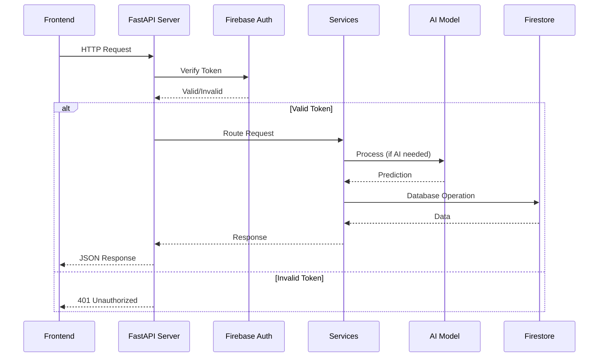

### Endpoint Categories

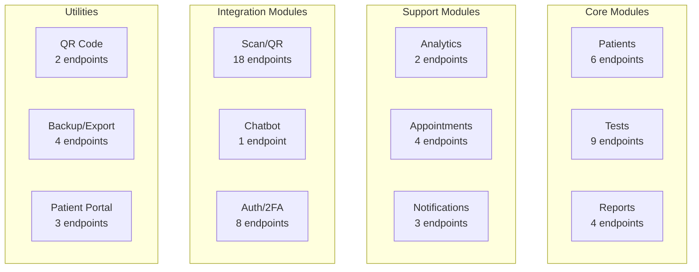

### Technology Stack

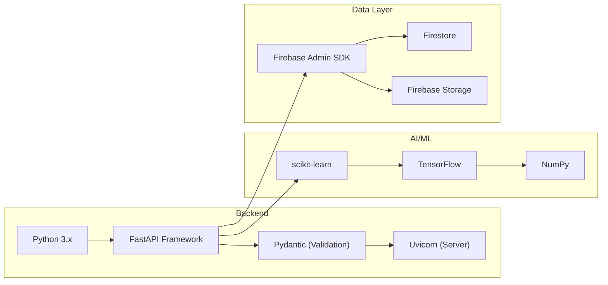

| Module | Endpoints | Description |
|--------|-----------|-------------|
| Auth | 8 | User registration, login, 2FA |
| Patients | 9 | CRUD operations, treatment tracking |
| Tests | 9 | Analysis, batch processing, confirmations |
| Reports | 4 | PDF/CSV generation |
| Analytics | 2 | Summary statistics, trends |
| Appointments | 4 | Scheduling CRUD |
| Scan/QR | 18 | QR code scanning, patient lookup |
| Notifications | 3 | Alert management |
| Chat | 1 | AI chatbot |
| Backup/Export | 4 | Data export, backup/restore |

### MLP Classifier for H. pylori Detection

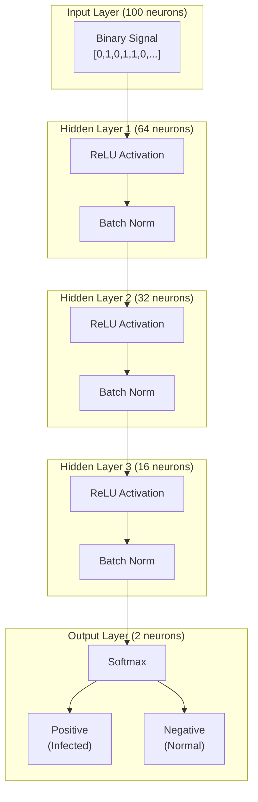

### Model Configuration

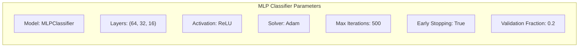

### Data Flow - Signal Processing

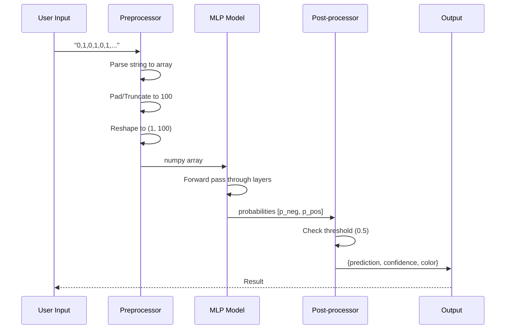

### Training Pipeline

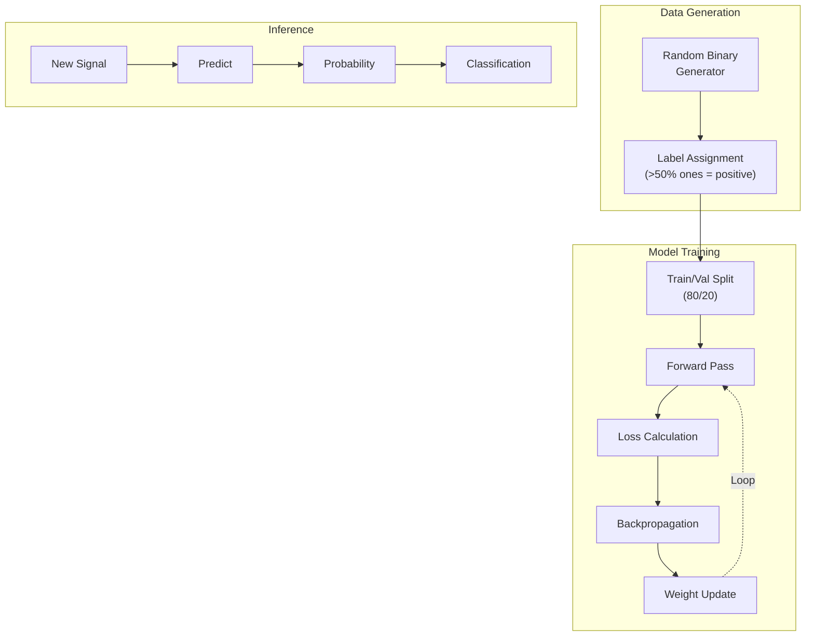

### Model Specifications

| Parameter | Value |
|-----------|-------|
| Model Type | MLPClassifier (sklearn) |
| Hidden Layers | (64, 32, 16) |
| Activation | ReLU |
| Optimizer | Adam |
| Max Iterations | 500 |
| Early Stopping | True |
| Validation Fraction | 0.2 |
| Input Size | 100 (binary signal length) |
| Output Classes | 2 (Positive/Negative) |
| Training Samples | 2000 (synthetic) |

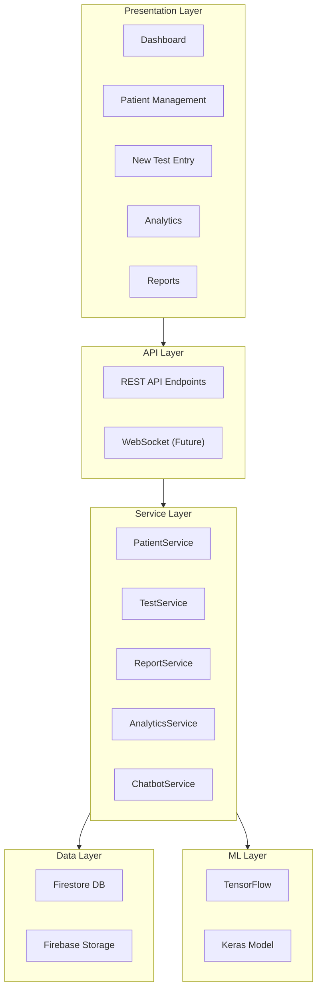

---

## Data Flow

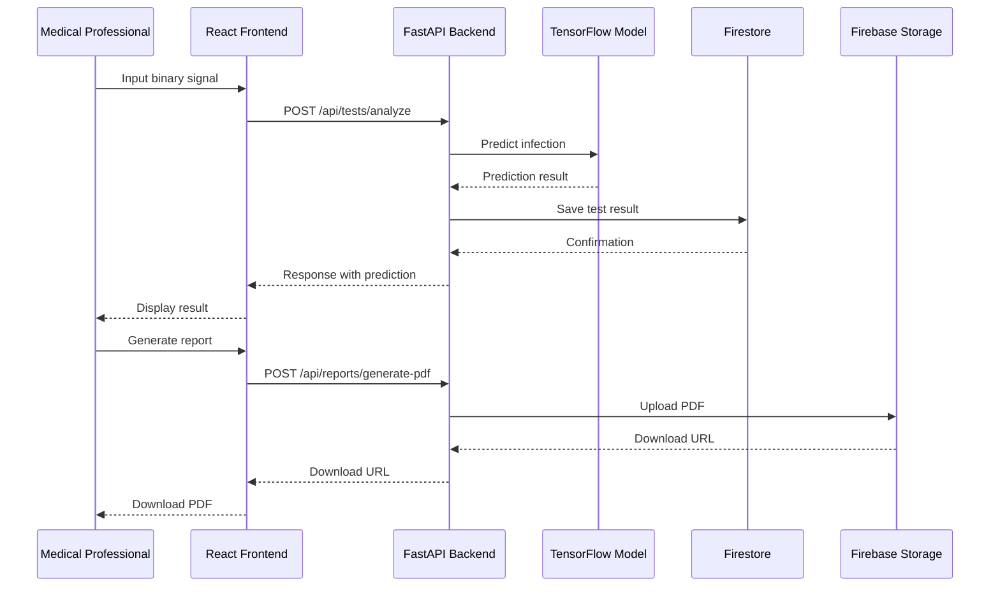
